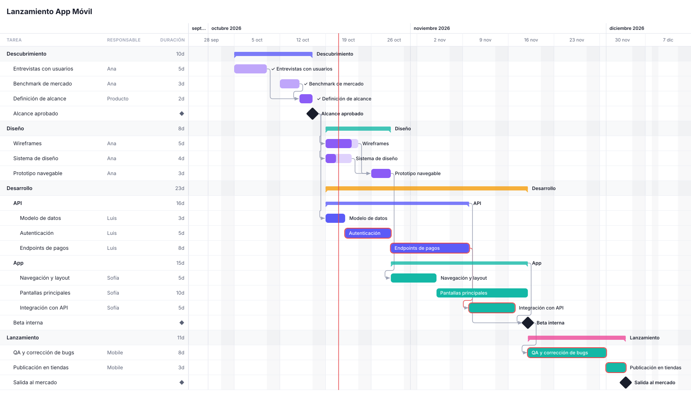
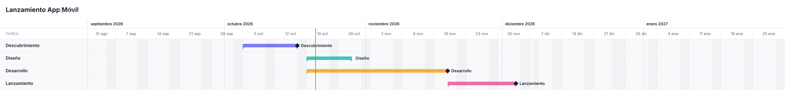
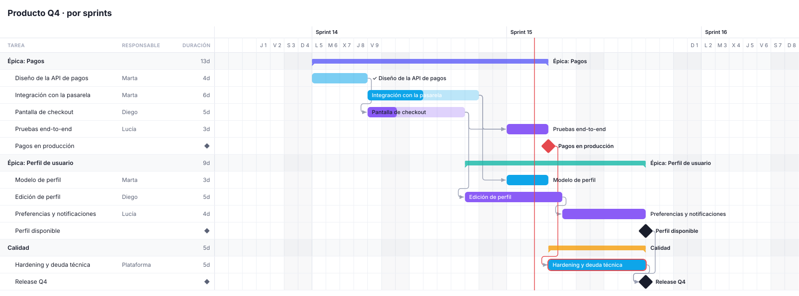

<div align="center">


# GanttMaker

**Diagramas de Gantt como código, con una interfaz que se toca.**

Escribí tu plan como texto (al estilo Mermaid) o armalo con el mouse: el código y el gráfico siempre están sincronizados.<br/>
100% en el navegador · sin servidor · instalable · funciona sin conexión.

[](https://github.com/CrisD404/GanttMaker/actions/workflows/deploy.yml)
[](LICENSE)
[](#-descargar-y-usar-sin-conexión)
[](#-tus-datos)
[](https://preactjs.com)
[](https://vite.dev)

**[Abrir la app](https://crisd404.github.io/GanttMaker/)** ·
[Guía de sintaxis](docs/SINTAXIS.md) ·
[Para agentes de IA](#-para-agentes-de-ia) ·
[Desarrollo](#-desarrollo)

<br/>

<picture>
  <source media="(prefers-color-scheme: dark)" srcset="docs/assets/preview-dark.svg" />
  
</picture>

</div>

## ✨ Por qué GanttMaker

|  |  |  |
|---|---|---|
| **⌨️ Código simple**<br/>Una línea por tarea: `Diseño @Ana 5d after Brief`. Autocompletado, errores en línea y fechas calculadas al lado de cada línea. | **🖱️ Interfaz que se toca**<br/>Arrastrá barras, estirá bordes, uní tareas, reordená filas. Doble clic y clic derecho hacen lo que esperás en cada lugar. | **🔁 Siempre sincronizados**<br/>Todo lo que hacés con el mouse se escribe en el código con cambios mínimos. Deshacer y rehacer son uno solo. |
| **👥 Responsables**<br/>Personas y equipos con colores y avatares. Filtrá por equipo y aparecen sus personas. | **🔍 Vistas por público**<br/>El mismo plan como roadmap ejecutivo, plan por equipo o tablero de riesgos, cada uno con su detalle, escala y filtros. | **🏃 Sprints**<br/>Cadencias personalizadas (`sprints 2w "Sprint {n}" first 14`) o sprints con fechas propias, con su propia escala. |
| **🎤 Presentar**<br/>Pantalla completa de solo lectura con puntero láser, foco, tareas destacadas y cambio de vista. | **📦 Descargable**<br/>Instalala como app (PWA) o bajá un único `.html` que funciona sin internet. | **🤖 Lista para IA**<br/>Documentación para agentes en `llms.txt` y como *skill*. Un LLM puede devolverte un enlace que abre su diagrama. |

## 🚀 En 30 segundos

```
gantt "Lanzamiento"
start 2026-11-02

section Diseño
  Bocetos @Ana 5d
  Prototipo @Ana 3d #active 40%
  Aprobación milestone

section Desarrollo
  API @Backend 10d after Bocetos #crit
  App @Sofía 8d after Prototipo
  Lanzamiento milestone after API, App
```

> **Regla de oro:** `@` es *quién*, `#` es *qué tipo* (estado, etiqueta o color), `5d`/`2w` es *cuánto dura* y `after` es *después de qué*.

| Escribís | Significa |
|---|---|
| `section Nombre` | Agrupa las tareas que siguen |
| `Tarea 5d` · `Tarea 2w` | Duración en días / semanas **hábiles** |
| `2026-11-10` · `2026-11-10..2026-11-20` | Inicio, o inicio y fin |
| `@Ana` · `@Backend` | Responsable (persona o equipo) |
| `after Diseño, API` | Empieza cuando terminan esas tareas |
| `milestone` | Hito |
| `60%` · `#done` `#active` `#blocked` · `#crit` | Avance, estado, tarea crítica |
| (indentación) | Subtareas |
| `view Ejecutivo` + `scale month` / `detail sections` | Vistas con su propio nivel de detalle |

La referencia completa está en **[docs/SINTAXIS.md](docs/SINTAXIS.md)** y también dentro de la app (tecla `?`).

## 🔍 El mismo plan, otro nivel de detalle

Cada bloque `view` es una pestaña con su escala, columnas, filtros y nivel de detalle. Los niveles ocultos se resumen en la barra del padre, hitos incluidos.

<picture>
  <source media="(prefers-color-scheme: dark)" srcset="docs/assets/executive-dark.svg" />
  
</picture>

```
view Ejecutivo
  scale month
  detail sections
  columns none
```

## 🏃 Sprints

```
sprints 2w "Sprint {n}" first 14
scale sprint
```

<picture>
  <source media="(prefers-color-scheme: dark)" srcset="docs/assets/sprints-dark.svg" />
  
</picture>

## 🖱️ Todo se puede hacer con el mouse

| Acción | Cómo |
|---|---|
| Mover / cambiar la duración | Arrastrá la barra o sus bordes |
| Crear una dependencia | Arrastrá el punto ● de una barra hasta otra |
| Crear una tarea en una fecha | Doble clic en un espacio vacío del gráfico |
| Editar en línea | Doble clic en el nombre o en cualquier celda (responsable, fechas, duración, avance) |
| Ajustar el zoom a un período | Doble clic en el encabezado (mes, semana, sprint…) |
| Más opciones | Clic derecho en tareas, secciones, flechas, encabezado, columnas y pestañas |
| Desplazarse | Arrastrá el fondo, o `Espacio` + arrastrar, o el botón del medio |
| Filtrar al instante | Dock flotante: búsqueda, personas, estados y etiquetas, para ocultar o atenuar |

## 🎤 Presentar

El botón **Presentar** (tecla `P`) muestra el gantt a pantalla completa, encuadrado y de solo lectura, con un dock flotante:

- **Láser** (`L`): un punto rojo con estela para señalar.
- **Foco** (`F`): oscurece todo menos un círculo que sigue al puntero.
- **Destacar**: clic en una tarea para resaltarla junto con sus dependencias.
- **Zoom y vistas**: `+` `-` `0` y `←` `→` para pasar de una vista a otra.
- **Tema** (`T`) y **Salir** (`Esc`).

## 💾 Tus datos

- **Todo queda en tu navegador.** No hay servidor ni cuentas, y nada sale de tu equipo.
- **Autoguardado.** Cada diagrama es un *espacio*; se guarda al instante, al cerrar y al cambiar de pestaña, y se sincroniza entre pestañas.
- **Almacenamiento persistente.** La app se lo pide al navegador para que no borre tus datos al liberar espacio.
- **Copias de seguridad.** Exportá e importá todos tus espacios en un `.json`.
- **Compartir.** El enlace de *Compartir* lleva el diagrama completo, comprimido en la URL. Quien lo abre lo recibe en un espacio nuevo, sin pisar los suyos.
- **Archivos.** Descargá el código como `.gantt`, exportá SVG o PNG e importá diagramas de **Mermaid**.

## 🧩 Plantillas

Para arrancar rápido hay plantillas con vista previa: **lanzamiento de app**, **producto por sprints**, **evento o conferencia**, **obra de construcción**, **campaña de marketing** e **implementación SaaS**. La primera visita incluye un tutorial corto, que se repite desde **?** → *Repetir tutorial*.

## 📦 Descargar y usar sin conexión

Desde el botón **App**:

- **Instalar como aplicación (PWA).** Ventana propia, funciona offline, abre archivos `.gantt` y te avisa cuando hay una versión nueva.
- **`ganttmaker.html`.** Toda la app en un único archivo (JS y CSS embebidos) para abrirla desde el disco, sin instalar nada.

## 🤖 Para agentes de IA

El sitio publica documentación para LLMs, que no aparece en la interfaz, siguiendo la convención [llms.txt](https://llmstxt.org) y el formato de *Agent Skills*:

| Ruta | Contenido |
|---|---|
| [`/llms.txt`](https://crisd404.github.io/GanttMaker/llms.txt) | Índice corto |
| [`/llms-full.txt`](https://crisd404.github.io/GanttMaker/llms-full.txt) | Guía para agentes + sintaxis completa |
| [`/skill/SKILL.md`](https://crisd404.github.io/GanttMaker/skill/SKILL.md) | La guía como *skill* (`name` / `description`) |

Un agente puede responder con un enlace que abre su diagrama directamente:

```
https://crisd404.github.io/GanttMaker/#src=<diagrama codificado con encodeURIComponent>
```

La guía vive en [docs/LLM.md](docs/LLM.md). Sus ejemplos se validan en los tests, así que nunca quedan desactualizados respecto del parser.

## 🛠 Desarrollo

Requiere Node 20.19+ (recomendado 24).

```bash
npm install
npm run dev            # http://localhost:5173
npm test               # parser, scheduler, writer, sprints, filtros, plantillas, docs
npm run build          # sitio estático en dist/ (+ PWA, ganttmaker.html y docs para LLMs)
npm run preview        # probar el build localmente
npm run readme:images  # regenerar las imágenes de este README
```

### Cómo está hecho

**El texto es la única fuente de verdad.** La interfaz nunca modifica el modelo directamente: genera un cambio de texto mínimo que se aplica a través del editor. Por eso deshacer y rehacer funcionan igual para el código y para el mouse.

```
src/
  core/      DSL puro (sin DOM): lexer, parser, scheduler, sprints, vistas y writer (UI → texto)
  render/    layout (filas, eje adaptativo, filtros), rutas de flechas y medición de texto
  editor/    CodeMirror 6: lenguaje, autocompletado, linter y fechas en línea
  gantt/     grilla, gráfico SVG, encabezado, inspector, dock de filtros y menús contextuales
  present/   modo presentación (láser, foco, dock)
  state/     estado global (signals), espacios, guardado, instalación y acciones
  io/        exportar SVG/PNG, importar Mermaid, archivos y copias de seguridad
  ui/        barra superior, controles propios (select, calendario), ayuda, tutorial y plantillas
tools/       plugins de Vite: PWA + archivo offline + íconos, y docs para LLMs
docs/        SINTAXIS.md (usuarios, también dentro de la app) y LLM.md (agentes)
```

**Stack:** [Preact](https://preactjs.com) + [Signals](https://preactjs.com/guide/v10/signals/), [CodeMirror 6](https://codemirror.net), [Vite](https://vite.dev), TypeScript y [Vitest](https://vitest.dev). Sin backend.

### Publicar en GitHub Pages

El workflow [`.github/workflows/deploy.yml`](.github/workflows/deploy.yml) corre tests y build y publica `dist/` en cada push a `main`. Hay que activarlo una sola vez: **Settings → Pages → Source: GitHub Actions**. Como el build usa rutas relativas, funciona en `https://<usuario>.github.io/<repo>/` sin configuración extra.

## 🗺 Hoja de ruta

- [ ] Ruta crítica calculada automáticamente
- [ ] Línea base (plan original vs. actual)
- [ ] Vista de carga de trabajo por persona
- [ ] Exportar a PDF
- [ ] Colaboración en tiempo real (sin servidor propio, p. ej. CRDT + WebRTC)

## 🤝 Contribuir

¡Las contribuciones son bienvenidas! Abrí un *issue* para conversar la idea o mandá un *pull request*:

1. `npm install` y `npm run dev`.
2. Si tocás el DSL, agregá tests en `src/core/*.test.ts` y actualizá `docs/SINTAXIS.md` y `docs/LLM.md` (sus ejemplos se validan solos).
3. `npm test` y `npm run build` tienen que pasar (el CI los corre en cada PR).

## 📄 Licencia

[MIT](LICENSE) © 2026 CrisD404
